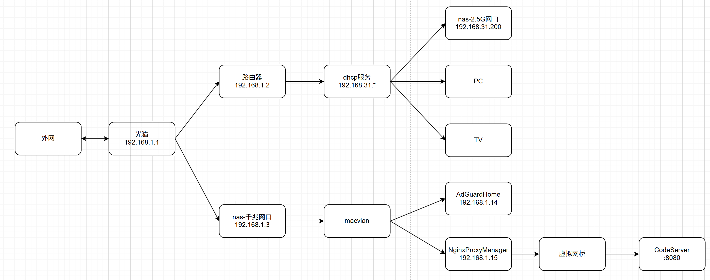

+++
date = '2025-06-17T11:59:08Z'
draft = true
title = 'Home server 折腾日记'
+++

最近又在折腾 home-server，准备搞个 all-in-one。此文做一个记录，方便以后查阅。折腾了两周左右，目前基本稳定了，基本达到了预期效果。

## 系统介绍

硬件：

- 主机：intel H410 平台，4G 内存+赛扬 G5900T 处理器
- 机箱：笨牛 B6，6 盘位主板（带背板）
- 电源：闲置的 450w 白金全模组电源
- 网络：双网口（板载千兆+pcie 扩展的 2.5G）
- 硬盘：2 块 SSD（512G+1T），3 块 HDD（14T+4T\*2）
  - SSD-512G：系统盘，剩余空间存放 docker 和其他应用的数据
  - SSD-1T：存放小文件数据（例如相册数据、电影的刮削数据等），重要数据备份到 4T 的 RAID 盘上
  - HDD-14T：影音盘，格式为 NTFS，存放影音数据
  - HDD-4T\*2：组 RAID1，主要做备份盘，存放图片和其他重要数据

软件：

- fnOS 做底层系统
- 使用 fnOS 提供的 docker 部署局域网服务
  - AdGuardHome 服务：局域网 dns 服务，提供广告过滤和自定义 dns 的能力
  - nginx-proxy-manager：反向代理服务，所有服务不对外暴露端口，都只能通过 npm 的反代进行访问
  - code-server：部署在服务器上的一个 vscode 服务器，可以随时通过浏览器进行访问

## 网络拓扑

整体入下：


重点：

1. 对 nas 的两个网口进行了功能划分
   1. 板载千兆网口负责外网连接
   2. pcie 扩展的 2.5G 网口仅用作内网传输和 fnOS 的访问地址
2. 使用 macvlan 隔离了 dns 和 npm 服务的 ip 地址，避免反代时的一些奇怪的问题和端口冲突
3. 其他 docker 服务都绑定到虚拟网桥，npm 通过虚拟网桥使用 container_name:port 的方式访问到服务
4. 所有服务统一通过 npm 反代进行暴露，不再需要对每个服务都进行端口映射

## docker 服务部署

docker 部署主要用的是 docker-compose 的方式（可以直接让 gpt 生成然后再手动微调）。目前使用的 docker-compose 文件如下:

```yaml
# All-in-one docker compose file, include
#   - 192.168.1.4 : dns service
#   - 192.168.1.5 : nginx-proxy-manager & other services

version: "3.8"

networks:
  # expose ip to local network
  macvlan_net:
    driver: macvlan
    driver_opts:
      parent: eno1 # 1G
    ipam:
      config:
        - subnet: 192.168.1.0/24
          gateway: 192.168.1.1

  # for communication between npm and other services
  internal_bridge:
    driver: bridge

services:
  # --------------------- dns service --------------------
  adguardhome: # admin port 3000
    image: adguard/adguardhome
    container_name: adguardhome
    restart: unless-stopped
    networks:
      macvlan_net:
        ipv4_address: 192.168.1.14 # admin port: 3000
    volumes:
      - ${APP_DATA_DIR}/adguardhome/workdir:/opt/adguardhome/work
      - ${APP_DATA_DIR}/adguardhome/confdir:/opt/adguardhome/conf

  # --------------------- npm service --------------------
  npm: # admin port 81
    image: chishin/nginx-proxy-manager-zh
    container_name: npm
    depends_on:
      - adguardhome
    restart: unless-stopped
    networks:
      macvlan_net:
        ipv4_address: 192.168.1.15
      internal_bridge: {} # let docker allocate ip
    volumes:
      - ${APP_DATA_DIR}/npm/data:/data
      - ${APP_DATA_DIR}/npm/letsencrypt:/etc/letsencrypt

  # ------------------- other services -------------------
  # for test purpose
  test_service: # admin port 80
    image: nginx:alpine
    container_name: test_service
    depends_on:
      - npm
    restart: unless-stopped
    networks:
      internal_bridge: {} # let docker allocate ip
  # browser vscode
  code-server: # admin port 8080
    container_name: code_server
    image: codercom/code-server
    volumes:
      - ${APP_DATA_DIR}/code-server/.config:/home/coder/.config
      - ${APP_DATA_DIR}/code-server/.local:/home/coder/.local
      - ${APP_DATA_DIR}/code-server/project:/home/coder/project
      - ${APP_DATA_DIR}/code-server/.ssh:/home/coder/.ssh
    environment:
      - PASSWORD=xy
    restart: unless-stopped
    networks:
      internal_bridge: {} # let docker allocate ip
```

## 后续

1. 集成旁路由功能，使用虚拟机的方式进行部署（需要再加一个网口，或者复用 2.5G 网口）。
